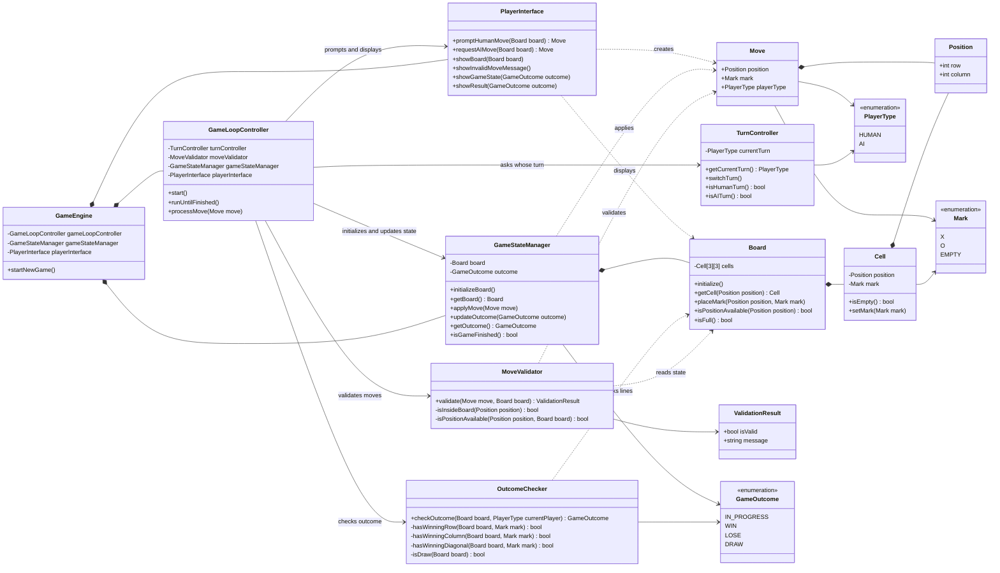

# Tic Tac Toe Game - Code Diagram

This UML code diagram is derived from the sequence diagrams, system context diagram, container diagram, and component diagram.

## Derivation Notes

- `GameEngine` is the top-level application system from the system context diagram.
- `GameLoopController`, `TurnController`, `MoveValidator`, `OutcomeChecker`, and `GameStateManager` come from the component diagram's `Game Engine Core`.
- `PlayerInterface` comes from the container and component diagrams and handles prompting, AI move requests, board display, invalid move messages, game state, and results.
- `Board`, `Cell`, `Move`, `Position`, `Mark`, `PlayerType`, `ValidationResult`, and `GameOutcome` are code-level domain types inferred from the sequence steps for board initialization, move validation, board updates, and win/lose/draw checks.
- `GameStateManager` owns board mutation because the latest component diagram routes board updates through the state manager and board model.
