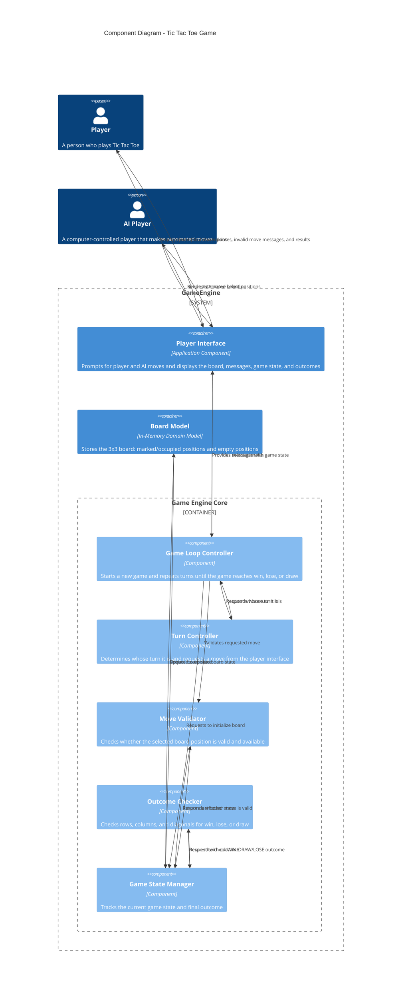

# Tic Tac Toe Game - Component Diagram

This component diagram is derived from the sequence diagrams, system context diagram, and container diagram.

```mermaid
C4Component
    title Component Diagram - Tic Tac Toe Game

    Person(player, "Player", "A person who plays Tic Tac Toe")
    Person(ai, "AI Player", "A computer-controlled player that makes automated moves")

    System_Boundary(engine, "GameEngine") {
        Container(playerInterface, "Player Interface", "Application Component", "Prompts for player and AI moves and displays the board, messages, game state, and outcomes")
        Container(boardModel, "Board Model", "In-Memory Domain Model", "Stores the 3x3 board: marked/occupied positions and empty positions")

        Container_Boundary(core, "Game Engine Core") {
            Component(gameLoopController, "Game Loop Controller", "Component", "Starts a new game and repeats turns until the game reaches win, lose, or draw")
            Component(turnController, "Turn Controller", "Component", "Determines whose turn it is and requests a move from the player interface")
            Component(moveValidator, "Move Validator", "Component", "Checks whether the selected board position is valid and available")
            Component(outcomeChecker, "Outcome Checker", "Component", "Checks rows, columns, and diagonals for win, lose, or draw")
            Component(gameStateManager, "Game State Manager", "Component", "Tracks the current game state and final outcome")
        }
    }

    Rel(player, playerInterface, "Sends selected board positions")
    Rel(playerInterface, player, "Displays prompts, board updates, invalid move messages, and results")

    Rel(ai, playerInterface, "Sends automated board positions")
    Rel(playerInterface, ai, "Requests AI move selection")

    Rel(gameLoopController, playerInterface, "Provides messages with game state")
    Rel(playerInterface, gameLoopController, "Provides selected move")

    Rel(gameLoopController, turnController, "Request whose turn it is")
    Rel(turnController, gameLoopController, "Responds whose turn it is")

    Rel(gameLoopController, gameStateManager, "Requests to initialize board")
    Rel(gameLoopController, moveValidator, "Validates requested move")

    Rel(moveValidator, gameStateManager, "Requests board state")
    Rel(moveValidator, gameStateManager, "Responds whether move is valid")
    Rel(gameStateManager, moveValidator, "Returns last board state")

    Rel(gameStateManager, boardModel, "Request to update board state")
    Rel(boardModel, gameStateManager, "Update board state")

    Rel(gameStateManager, outcomeChecker, "Request to check WIN/DRAW/LOSE outcome")
    Rel(outcomeChecker, gameStateManager, "Respond with outcome")


```
