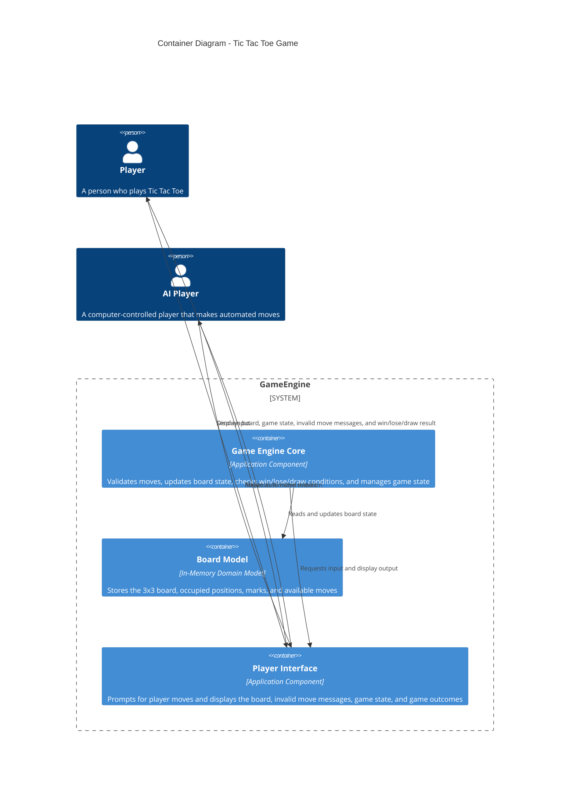

# Tic Tac Toe Game - Container Diagram

This container diagram is derived from the sequence diagrams and system context diagram.

## Derivation Notes

- `GameEngine` is the system boundary from the updated system context diagram.
- `Game Engine Core` comes from the central sequence participant responsible for starting games, turn flow, move validation, board updates, and result checks.
- `Board Model` is derived from the repeated board initialization, move validation, state updates, and row/column/diagonal checks.
- `Player Interface` represents the prompts, board display, invalid move message, and result display shown in the sequence diagrams.
