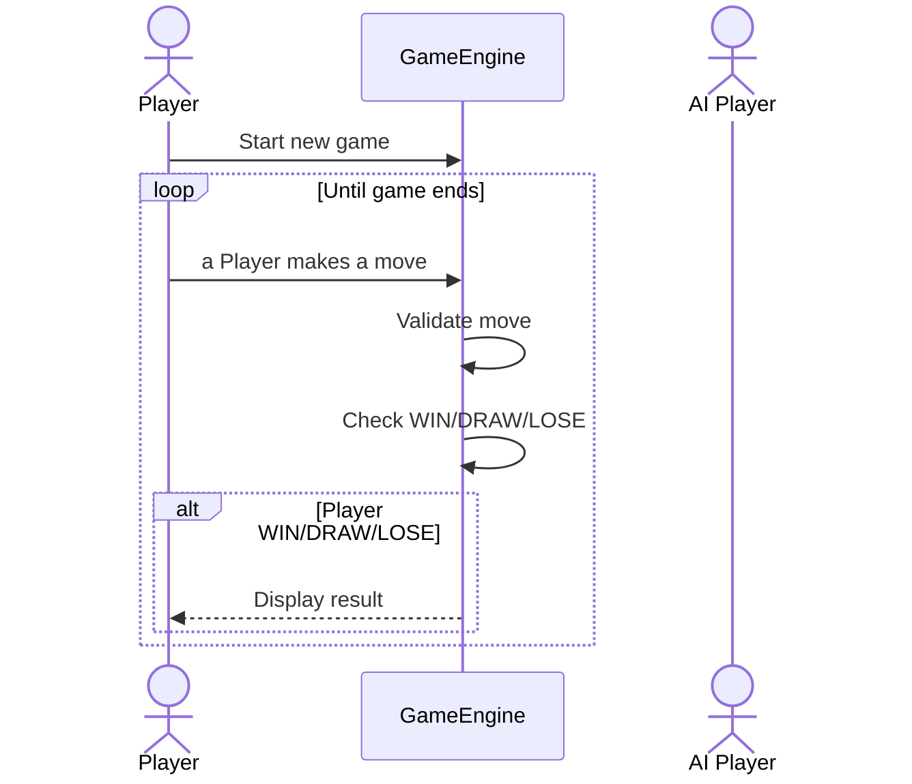
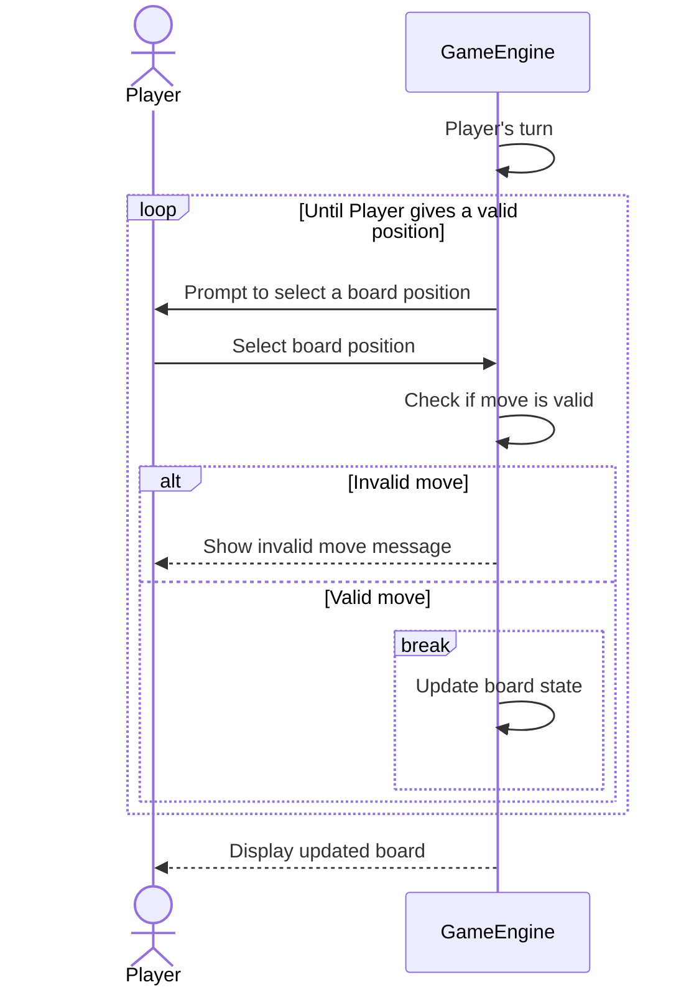
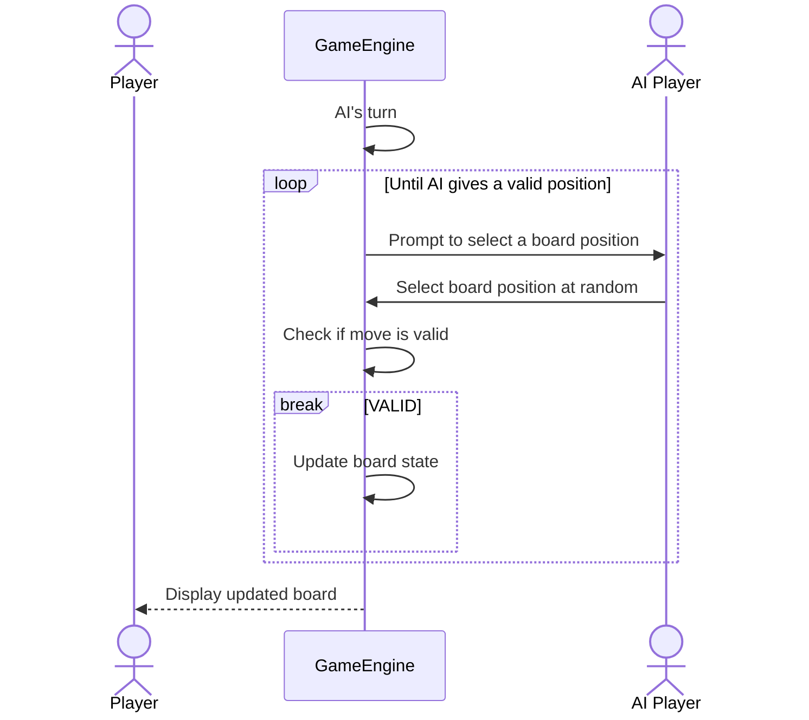
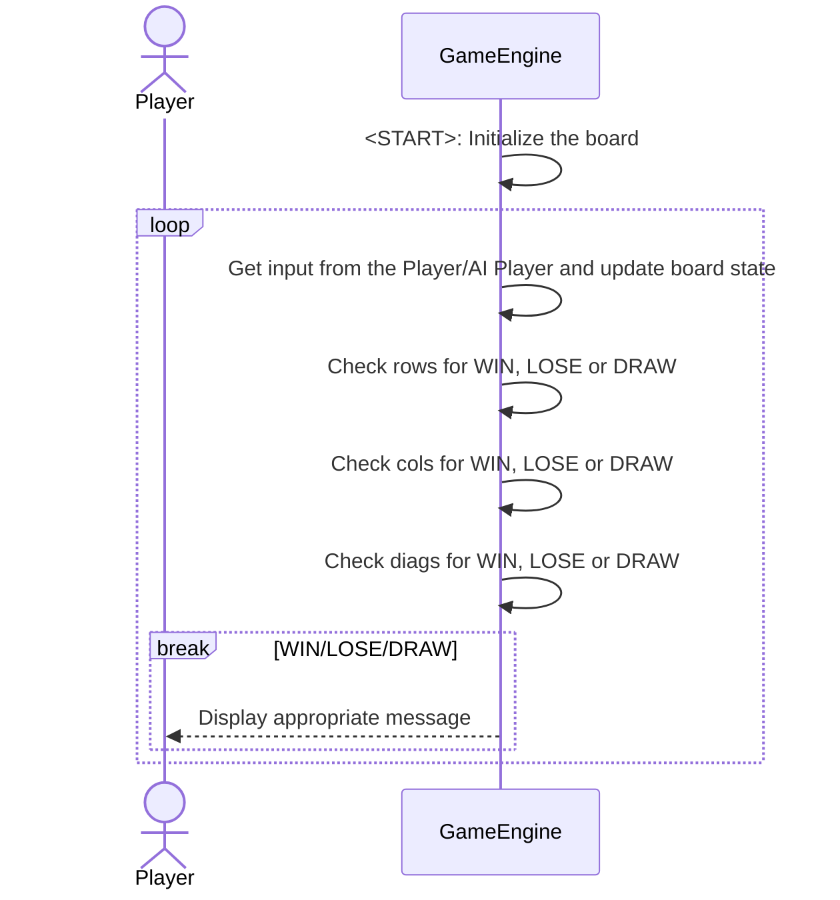

# Tic Tac Toe Game - Sequence Diagrams

## 1. Complete Game Flow

```mermaid
sequenceDiagram
    actor Player
    participant Game as GameEngine
    actor AI as AI Player

    Player->>Game: Start new game

    loop Until game ends
        Player->>Game: a Player makes a move
        Game->>Game: Validate move
        Game->>Game: Check WIN/DRAW/LOSE

        alt Player WIN/DRAW/LOSE
            Game-->>Player: Display result
        end
    end
```

---

## 2. Human Player makes a move

```mermaid
sequenceDiagram
    actor Player
    participant Game as GameEngine

    Game->>Game: Player's turn

    loop Until Player gives a valid position
        Game->>Player: Prompt to select a board position
        Player->>Game: Select board position
        Game->>Game: Check if move is valid

        alt Invalid move
            Game-->>Player: Show invalid move message
        else Valid move
            break
                Game->>Game: Update board state
            end
        end
    end
    Game-->>Player: Display updated board
```

---

## 3. AI Player makes a move

```mermaid
sequenceDiagram
    actor Player
    participant Game as GameEngine
    actor AI as AI Player

    Game->>Game: AI's turn

    loop Until AI gives a valid position
        Game->>AI: Prompt to select a board position
        AI->>Game: Select board position at random
        Game->>Game: Check if move is valid

        break VALID
            Game->>Game: Update board state
        end
    end

    Game-->>Player: Display updated board
```

---

## 4. Main Game Loop

```mermaid
sequenceDiagram
    actor Player
    participant Game as GameEngine

    Game->>Game: <START>: Initialize the board

    loop
        Game->>Game: Get input from the Player/AI Player and update board state
        Game->>Game: Check rows for WIN, LOSE or DRAW
        Game->>Game: Check cols for WIN, LOSE or DRAW
        Game->>Game: Check diags for WIN, LOSE or DRAW

        break WIN/LOSE/DRAW
            Game-->>Player: Display appropriate message
        end
    end
```

---
