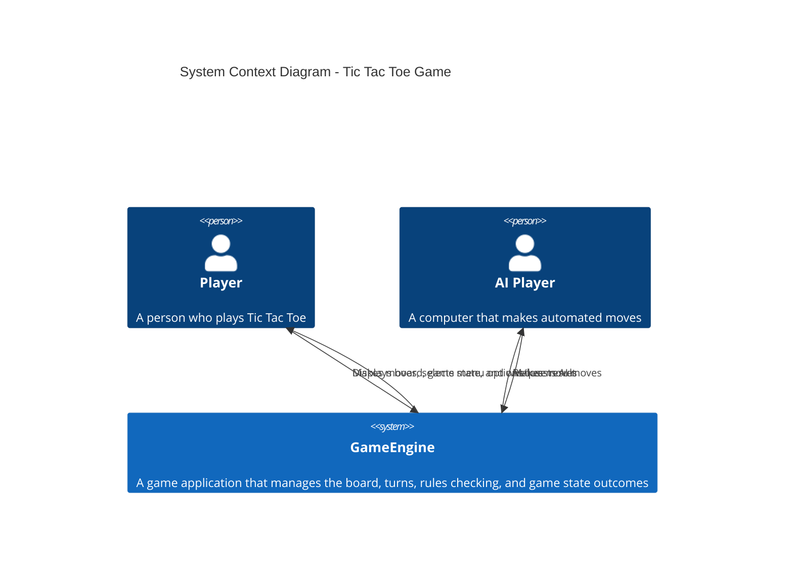

# Tic Tac Toe Game - System Context Diagram

This document describes the high-level system context of a Tic Tac Toe game.

```mermaid
C4Context
    title System Context Diagram - Tic Tac Toe Game

    Person(player, "Player", "A person who plays Tic Tac Toe")
    Person(ai, "AI Player", "A computer that makes automated moves")

    System(engine, "GameEngine", "A game application that manages the board, turns, rules checking, and game state outcomes")

    Rel(player, engine, "Makes moves, selects menu options")
    Rel(engine, player, "Displays board, game state, and win/lose result")

    Rel(ai, engine, "Makes moves")
    Rel(engine, ai, "Requests AI moves")
```
